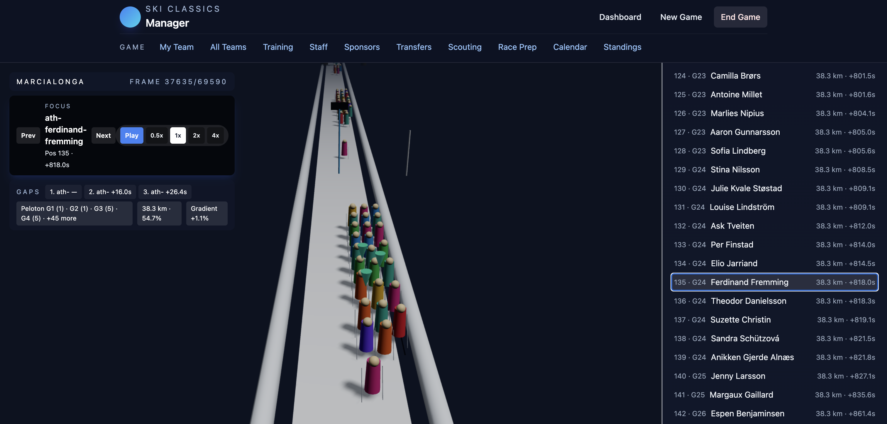

# Ski Classics Manager

Manage a long-distance ski team with training, finances, transfers, and a 3D race viewer built on Next.js + React Three Fiber. This repo contains the full game loop, sample data, simulation engines, and UI.



## Contents
- [Overview](#overview)
- [Getting Started](#getting-started)
- [Scripts](#scripts)
- [Project Structure](#project-structure)
- [Key Features](#key-features)
- [Docs](#docs)
- [Troubleshooting](#troubleshooting)

## Overview
- **Tech**: Next.js (App Router), React, Zustand store, Tailwind, React Three Fiber for races.
- **Simulation**: Training, finance, race engine producing snapshots for the viewer.
- **Data**: Sample teams/athletes, GPX tracks, race calendar seeded in `src/game/data`.

## Getting Started
1) Install (Node 18+):
   ```bash
   npm install
   ```
2) Dev server:
   ```bash
   npm run dev
   ```
   Visit http://localhost:3000
3) Start a game:
   - Use “New Game” to pick a team.
   - From the dashboard, click “Start next race” to jump into the race viewer (auto-navigates).

## Scripts
- `npm run dev` – start Next.js dev server
- `npm run build` / `npm start` – production build/serve
- `npm run lint` – lint code
- `npm run test:unit` – Vitest unit tests
- `npm run test:e2e` – Playwright E2E tests
- `npm run test:all` – lint + unit + e2e

## Project Structure
- `src/app/` – Next.js routes and pages (dashboard, race, training, etc.)
- `src/components/` – UI components; `race/` contains HUD and 3D viewer
- `src/state/gameStore.ts` – Zustand store (game loop orchestration)
- `src/game/domain/` – Types and domain helpers
- `src/game/simulation/` – Training, finance, race engines
- `src/game/data/` – Sample data, GPX tracks, athlete pool
- `docs/` – In-depth documentation (see below)

## Key Features
- **Race viewer**: 3D course with drafting, lanes, player highlights, focus controls, and weather presets.
- **Race prep**: Lineup, pacing/tactic, gear choices.
- **Game loop**: Weekly training/finance application, standings, transfers, scouting.
- **Persistence**: Local storage with migration guard; resets if corrupted.

## Docs
- [Architecture](docs/architecture.md) – app layout, data flow, state, race viewer.
- [Gameplay & Systems](docs/gameplay.md) – game loop, training, finance, transfers, scouting.
- [Race Engine](docs/race-engine.md) – simulation inputs/outputs, drafting, pacing, collision handling.
- [Frontend & UI](docs/frontend.md) – routes, components, HUD controls, performance toggles.

## Troubleshooting
- **Hydration mismatch**: Locale-formatting normalized to `en-US`; clear cache/local storage and reload if stuck.
- **Race viewer not loading**: Ensure a game is started; “Start next race” auto-navigates. If snapshots are missing, GPX falls back to course segments.
- **Corrupt save**: Local storage key `ski-manager-save` is auto-migrated/reset; you can also clear it manually via DevTools > Application > Local Storage.

## License
MIT
